# Claude Code 安装教程 —— 搭载 DeepSeek 国产大模型

> **目标读者**：零基础用户，希望用上 AI 编程助手，但不想折腾国外账号和科学上网。
> **最终效果**：在 VS Code 中免费/低成本使用 Claude Code，底层由 DeepSeek 国产大模型驱动。

---

## 目录

- [前置准备](#前置准备)
- [第一步：安装 Node.js（运行环境）](#第一步安装-nodejs运行环境)
- [第二步：安装 Git（版本控制工具）](#第二步安装-git版本控制工具)
- [第三步：安装 Claude Code CLI](#第三步安装-claude-code-cli)
- [第四步：接入 DeepSeek（核心步骤）](#第四步接入-deepseek核心步骤)
- [第五步：VS Code 集成](#第五步vscode-集成)
- [常见问题排查](#常见问题排查)
- [总结](#总结)

---

## 前置准备

在开始之前，请确认你的系统满足以下要求：

| 项目 | 要求 |
|------|------|
| 操作系统 | Windows 10 / 11（macOS / Linux 也可参考） |
| 网络环境 | 普通国内网络即可（**不需要科学上网**） |
| 前置知识 | 会打开命令行（cmd 或 PowerShell）即可 |
| 费用预算 | DeepSeek API 按量计费，充值 10 元可用很久（约百万次简单对话） |
| 所需时间 | 约 30～45 分钟完成全部配置 |

> 💡 **为什么选择 DeepSeek？** Claude 官方的 API 需要国外信用卡、价格昂贵（$3～$15 / 百万 tokens），账号还经常被封。DeepSeek 是国产大模型，价格仅为 Claude 的 **几十分之一**，且通过 CC-Switch 一键对接，无需任何科学上网手段。

---

## 第一步：安装 Node.js（运行环境）

Claude Code 是一个 Node.js 应用，必须先安装 Node.js 才能运行。

### 1.1 下载 Node.js

访问 Node.js 官网下载页面：

```
https://nodejs.org/zh-cn/download
```

- **推荐选择 LTS 版本**（长期支持版，如 v20.x.x），稳定性更好
- 根据你的系统选择对应安装包（Windows 用户选 `.msi` 或 `.exe`）
- 下载后双击运行，保持默认选项一路「Next」即可

### 1.2 验证安装

安装完成后，打开命令行验证：

1. 按下 `Win + R`，输入 `cmd`，回车打开命令提示符
2. 输入以下命令并回车：

```bash
node -v
```

如果出现版本号（例如 `v20.11.0`），说明 Node.js 安装成功。

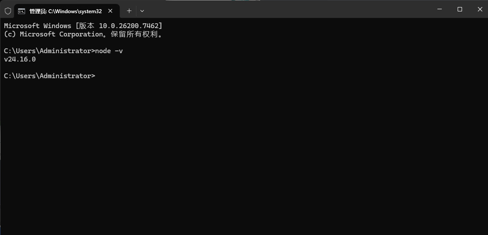

---

## 第二步：安装 Git（版本控制工具）

Git 是 Claude Code 运行的**必要组件**，如果不安装，Claude Code 会直接报错。

### 2.1 下载 Git

访问 Git 官方网站：

```
https://git-scm.com/downloads
```

- 下载 Windows 版本的安装包
- 双击运行，保持默认选项一路「Next」即可（无需修改任何配置）

### 2.2 验证安装

安装完成后，在 cmd 中输入：

```bash
git --version
```

出现版本号（如 `git version 2.45.0.windows.1`）即表示安装成功。

> ⚠️ **重要提醒**：Git 是**必需**组件，如果不安装，Claude Code 运行时会直接报错退出。

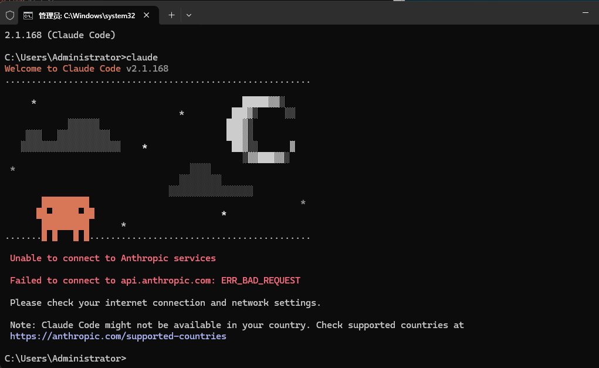

---

## 第三步：安装 Claude Code CLI

### 3.1 安装命令

打开 **PowerShell**（推荐以管理员身份运行）或 **cmd**，执行以下命令：

```bash
npm install -g @anthropic-ai/claude-code
```

- `-g` 表示全局安装，安装后在任何目录都可以直接使用 `claude` 命令
- 安装过程可能需要 1～2 分钟，请耐心等待

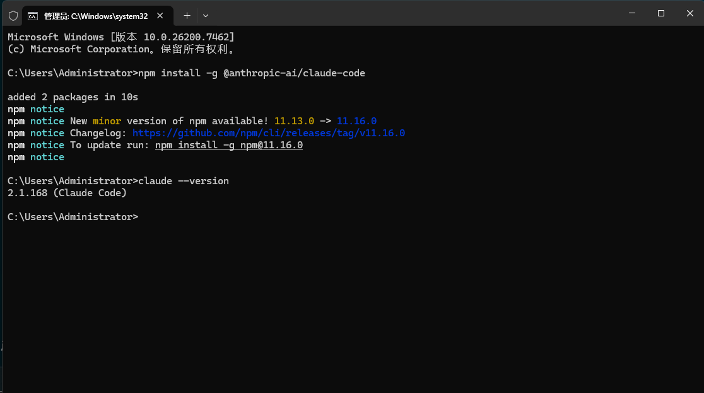

### 3.2 加速技巧（可选）

如果安装速度过慢，可以先切换到国内 npm 镜像源：

```bash
npm config set registry https://registry.npmmirror.com
```

设置后再执行安装命令，速度会快很多。

### 3.3 修改配置文件（绕过登录引导）

安装完成后，直接运行 `claude` 会提示需要登录 Claude 账号。由于我们要用 DeepSeek 替代 Claude API，需要先修改配置文件跳过登录引导。

1. 打开 Claude Code 配置文件 `claude.json`，文件位置：
   - **Windows**：`C:\Users\你的用户名\.claude\claude.json`
   - **macOS / Linux**：`~/.claude/claude.json`

2. 在 JSON 文件中添加以下配置项：

```json
{
  "hasCompletedOnboarding": true
}
```

> 🔧 如果文件中已有其他配置项，只需在其中追加 `"hasCompletedOnboarding": true` 即可（注意 JSON 格式，前面加逗号）。

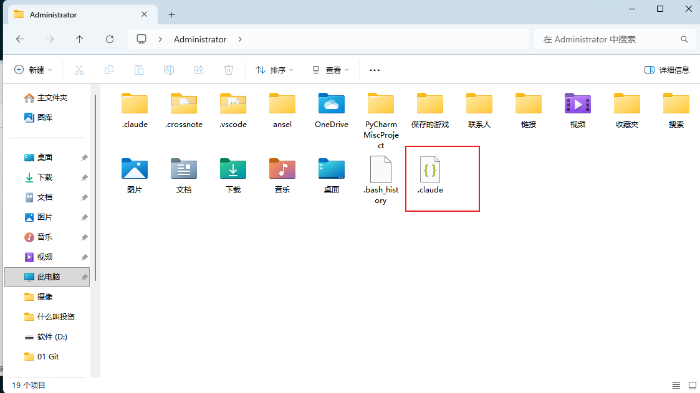

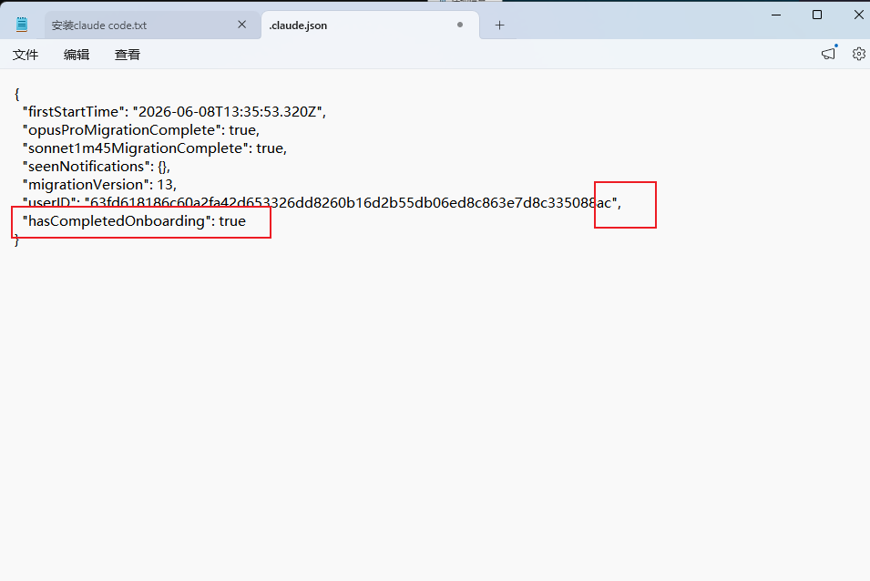

3. 保存文件后，在 cmd 中输入 `claude` 回车：

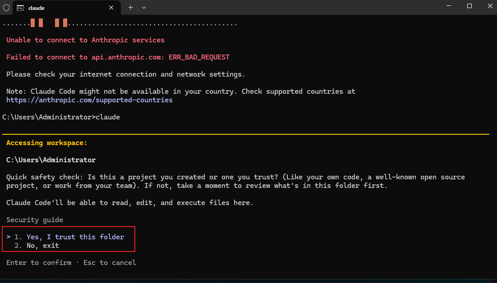

此时会出现登录提示，因为我们还没有配置 DeepSeek，接下来进入最关键的步骤。

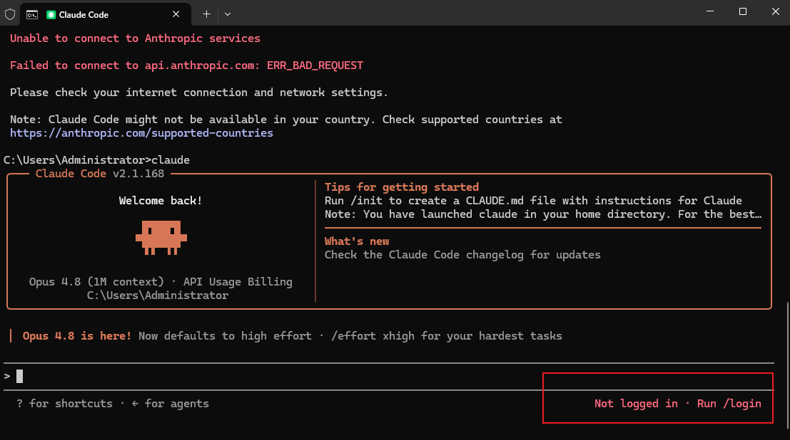

---

## 第四步：接入 DeepSeek（核心步骤）

这是整个教程最重要的一步。通过开源工具 **CC-Switch**，我们可以将 Claude Code 的底层大模型从 Claude API 切换为 DeepSeek 国产大模型，实现：
- ✅ 无需科学上网
- ✅ 无需国外账号，告别封号风险
- ✅ 成本降低数十倍
- ✅ 中文理解能力更强

### 4.1 认识 CC-Switch

**CC-Switch** 是一个开源工具，专门用于一键切换 Claude Code 背后的大模型 API。

| 特性 | 说明 |
|------|------|
| 开源免费 | 代码托管在 GitHub，无需付费 |
| 一键切换 | 支持 DeepSeek、通义千问等多个国产模型 |
| 配置简单 | 图形界面操作，填入 API Key 即可 |
| 社区活跃 | 持续更新，兼容最新版 Claude Code |

### 4.2 下载 CC-Switch

访问 CC-Switch 的 GitHub 仓库：

```
https://github.com/farion1231/cc-switch
```

- 在页面右侧找到 **Releases** 栏目
- 下载最新版本的安装包（Windows 用户选 `.exe` 文件）
- 下载后双击运行安装

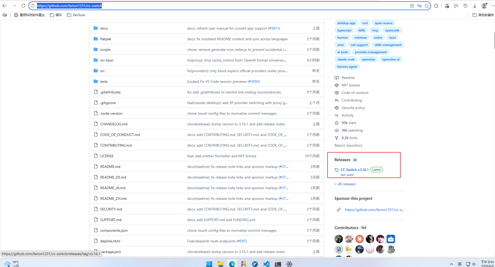

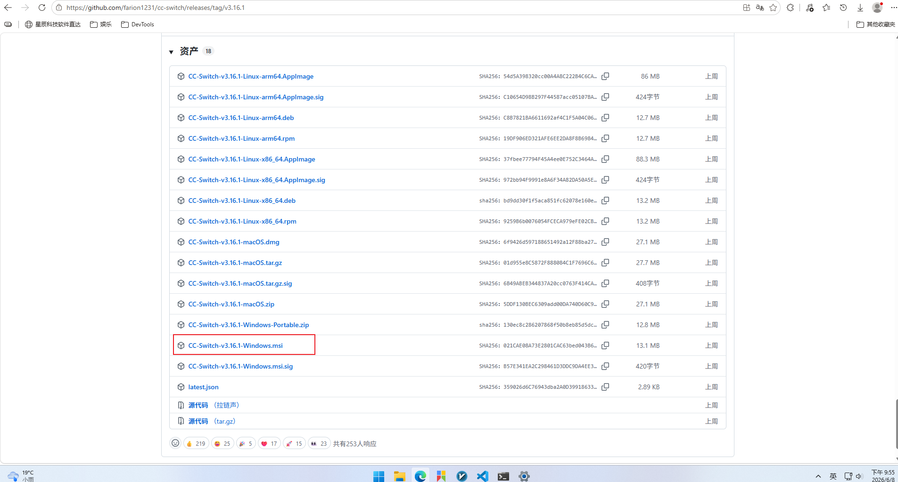

### 4.3 获取 DeepSeek API Key

#### 4.3.1 注册 DeepSeek 账号

1. 打开 DeepSeek API 开放平台：**https://platform.deepseek.com**
2. 点击注册，使用手机号完成注册
3. 登录后进入控制台

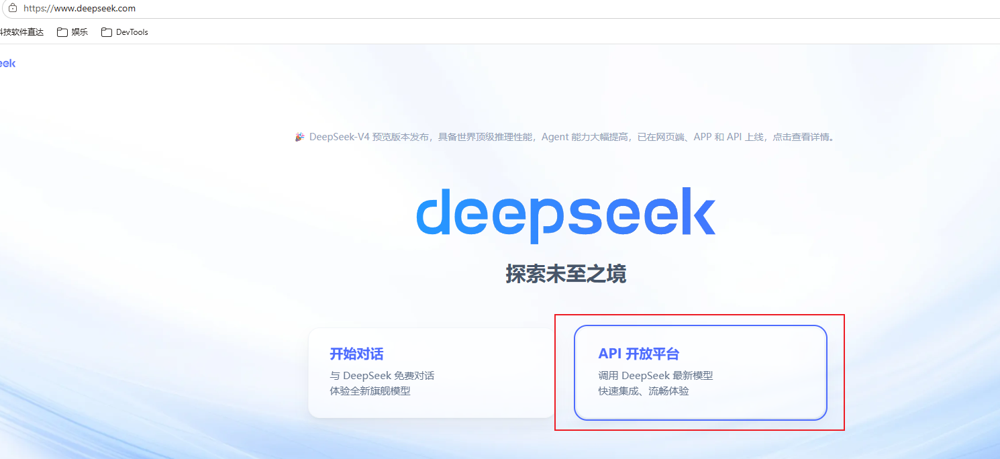

#### 4.3.2 创建 API Key

1. 在左侧菜单找到「**API Keys**」页面
2. 点击「**创建 API Key**」按钮
3. 给 Key 起个名字（如 `claude-code`），点击创建
4. **立即复制生成的密钥**（格式为 `sk-xxxxxxxxxxxxxxxx`）

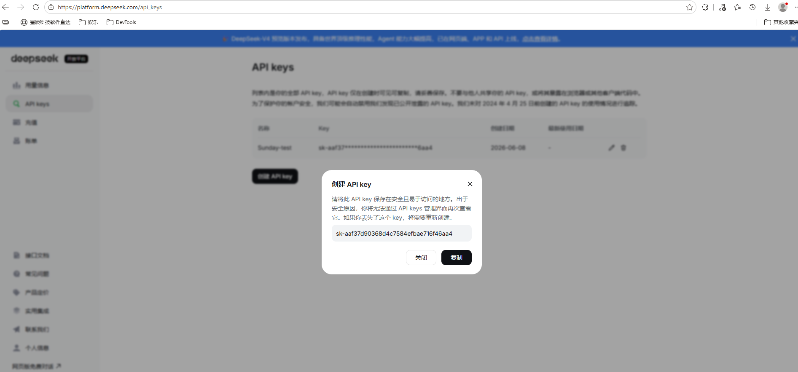

> ⚠️ **重要**：API Key **只显示一次**，关闭页面后就无法再次查看。请务必立即复制并保存到安全的地方！

#### 4.3.3 实名认证与充值

1. 在 DeepSeek 平台完成**实名认证**（按照平台指引操作）
2. 认证通过后，进入「**充值**」页面
3. 建议首次充值 **10～20 元**即可，足够使用很长时间

| 模型 | 输入价格 | 输出价格 | 相当于 |
|------|---------|---------|--------|
| **DeepSeek-V3** | ¥1 / 百万 tokens | ¥2 / 百万 tokens | 约 1 元 = 50 万字的对话 |
| Claude Sonnet 4 | $3 / 百万 tokens | $15 / 百万 tokens | 约 ¥130 / 百万 tokens |

> 💰 **价格对比一目了然**：DeepSeek 的成本仅为 Claude 官方的 **不到 2%**，充值 10 元可以产生数百万字的对话。

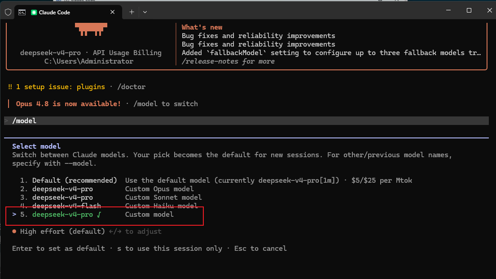

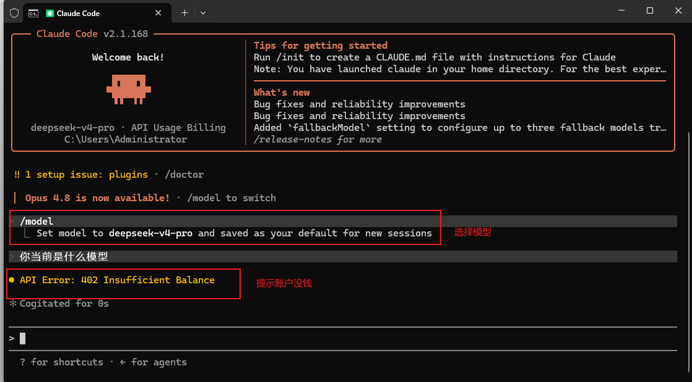

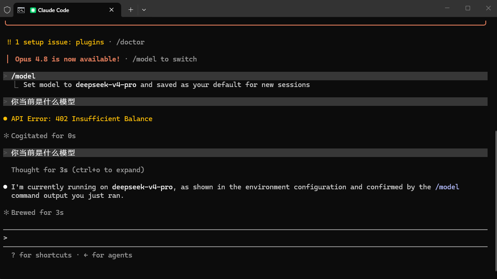

### 4.4 在 CC-Switch 中配置 DeepSeek

1. **打开 CC-Switch**，进入主界面
2. 点击「**添加模型**」或「**新增配置**」
3. 在模型列表中选择「**DeepSeek**」
4. 在 API Key 输入框中**粘贴**刚才复制的 `sk-xxxxxxxxxxxxxxxx` 密钥
5. 点击保存

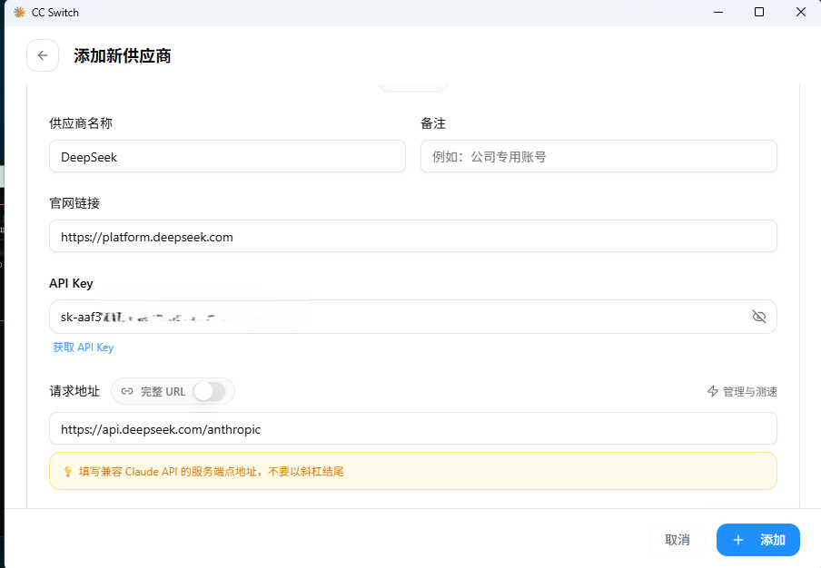

### 4.5 验证配置

配置完成后，重新打开 cmd，输入：

```bash
claude
```

如果不再出现登录提示，而是直接进入 Claude Code 的对话界面，说明配置成功！

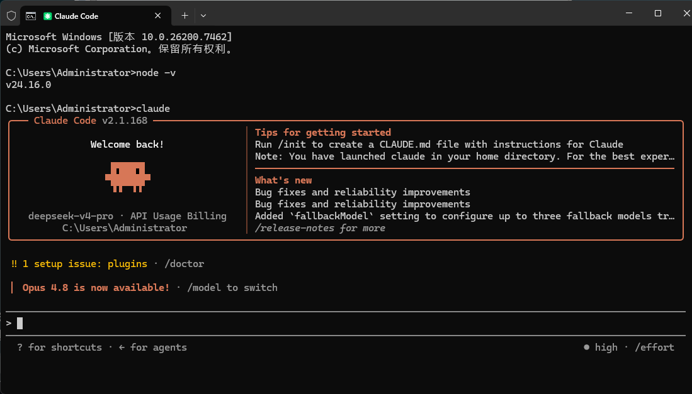

🎉 **恭喜！** Claude Code 已经成功对接 DeepSeek 国产大模型，你现在可以开始使用 AI 编程助手了。

---

## 第五步：VS Code 集成

虽然 cmd 中可以使用 Claude Code，但在 **VS Code** 中运行会更加高效——可以可视化查看代码变更、对比差异、管理项目。

### 5.1 安装 VS Code

如果你还没有 VS Code，请前往官网下载：

```
https://code.visualstudio.com
```

微软出品的免费编辑器，轻量且功能强大。

### 5.2 安装 Claude Code 插件

1. 打开 VS Code
2. 点击左侧的「**扩展**」图标（或按 `Ctrl + Shift + X`）
3. 在搜索框中输入 **"Claude Code"**
4. 找到 Anthropic 官方发布的 Claude Code 插件
5. 点击「**Install**」（安装），等待安装完成

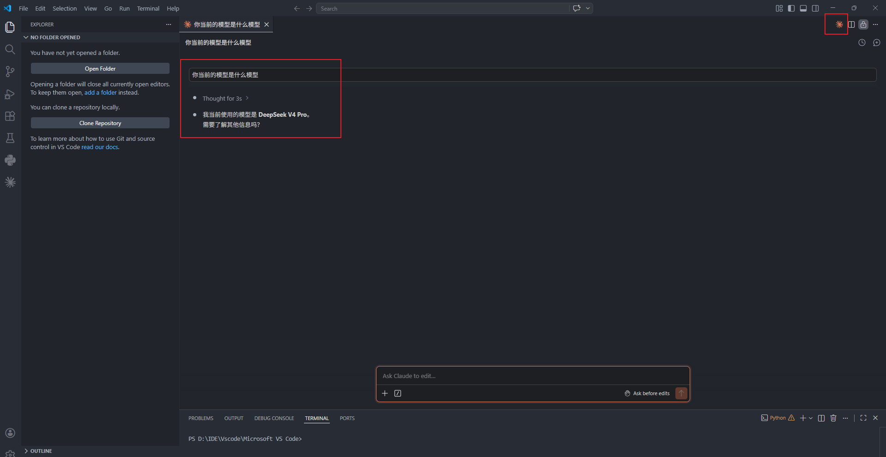

### 5.3 在 VS Code 终端中运行

插件安装完成后：

1. 在 VS Code 中按 `` Ctrl + ` `` 打开内置终端（或菜单：查看 → 终端）
2. 在终端中输入：

```bash
claude
```

3. Claude Code 会直接在 VS Code 中启动

### 5.4 解决 PowerShell 执行策略报错

如果在 VS Code 的终端中运行 `claude` 时出现以下错误：

```
无法加载文件 claude.ps1，因为在此系统上禁止运行脚本
```

这是因为 Windows PowerShell 的默认安全策略阻止了脚本运行。解决方法如下：

**（推荐）为当前用户永久修改执行策略：**

1. 打开 PowerShell（**不需要**管理员权限）
2. 执行以下命令：

```powershell
Set-ExecutionPolicy -ExecutionPolicy RemoteSigned -Scope CurrentUser
```

3. 系统询问是否更改时，输入 `Y` 并回车确认
4. 关闭当前终端，重新打开后再次运行 `claude` 即可

> 📝 **说明**：`RemoteSigned` 策略允许运行本地创建的脚本，从网络下载的脚本仍需签名才能运行。这样既解决了问题，也保留了安全性。

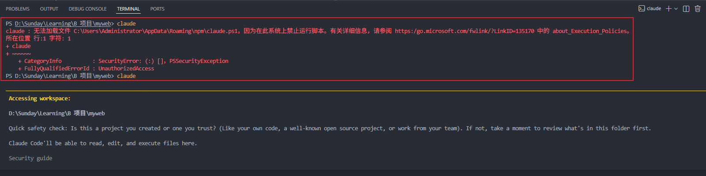

---

## 常见问题排查

### Q1：`npm install -g @anthropic-ai/claude-code` 报错

**可能原因与解决：**
- **网络问题**：切换到国内镜像源 `npm config set registry https://registry.npmmirror.com`
- **权限不足**：使用管理员身份运行 PowerShell 再执行
- **Node.js 版本太低**：升级到 Node.js 18+ 版本

### Q2：运行 `claude` 提示找不到命令

- 确认 npm 全局安装成功（重新执行安装命令）
- 关闭并重新打开 cmd/PowerShell 窗口
- 检查 npm 全局路径是否在系统 PATH 环境变量中

### Q3：运行 `claude` 提示找不到 Git

- 确认已安装 Git（在 cmd 中输入 `git --version` 验证）
- 如果已安装但仍报错，可能是 Git 没有加入 PATH，重新安装 Git 并勾选「Add Git to PATH」

### Q4：CC-Switch 配置后仍然提示登录

- 检查 API Key 是否正确粘贴（注意没有多余的空格）
- 确认 DeepSeek 账号已完成实名认证并充值
- 重启 CC-Switch 和 cmd 窗口再试
- 检查 `claude.json` 中的 `hasCompletedOnboarding` 是否设为 `true`

### Q5：DeepSeek API 返回错误

- **余额不足**：登录 DeepSeek 平台查看余额，及时充值
- **API Key 失效**：在 DeepSeek 平台重新生成 Key，并在 CC-Switch 中更新
- **实名认证未通过**：完成实名认证后才能使用 API

### Q6：VS Code 终端无法运行 `claude`

- 确认已在外部 cmd 中成功运行过 `claude`
- 按照 [5.4 节](#54-解决-powershell-执行策略报错) 修改 PowerShell 执行策略
- 关闭 VS Code 并重新打开

---

## 总结

### 安装清单回顾

| 步骤 | 组件 | 作用 | 状态 |
|------|------|------|------|
| 1 | Node.js | 运行环境 | ☐ |
| 2 | Git | 版本控制 | ☐ |
| 3 | Claude Code CLI | AI 编程工具 | ☐ |
| 4 | CC-Switch + DeepSeek | 国产大模型接入 | ☐ |
| 5 | VS Code 插件 | 可视化编辑器 | ☐ |

### 核心优势

```
Claude Code（前端交互层）
        ↕
  CC-Switch（模型路由层）
        ↕
  DeepSeek API（国产大模型）
        ↓
 ✅ 无需科学上网   ✅ 无需国外账号
 ✅ 价格仅为 Claude 的 2%   ✅ 中文更友好
 ✅ 永久稳定使用   ✅ 社区持续维护
```

### 下一步

安装完成后，你可以：
- 查看 [`Claude Code 命令指南.md`](./Claude%20Code%20命令指南.md) 学习日常使用技巧
- 在项目目录下运行 `claude`，输入 `/init` 让 AI 分析你的项目
- 尝试让 Claude Code 帮你写代码、修 Bug、做代码审查

---

> 📅 更新日期：2026 年 6 月 13 日
>
> 💡 提示：本教程搭配 [`Claude_Code_安装教程.pptx`](./Claude_Code_安装教程.pptx) 演示文稿，适合培训和分享使用。
